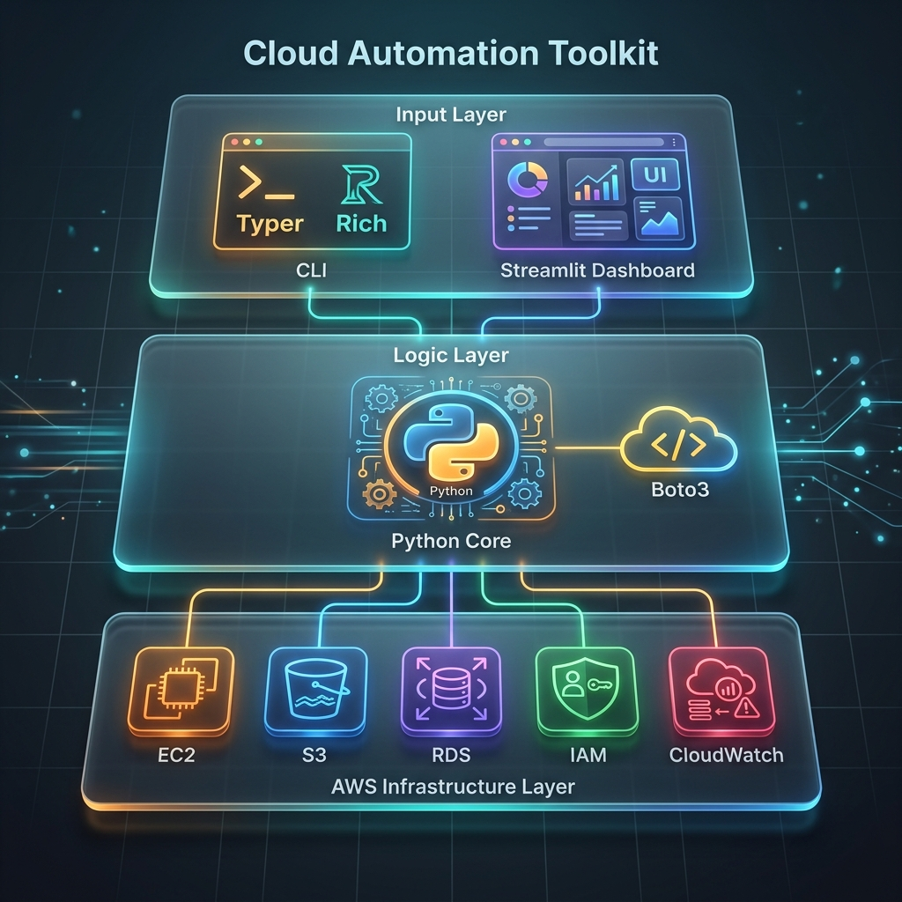

# CloudTool - Kit de Automação AWS

<div align="center">


</div>

---

## 🏗️ Arquitetura Proposta



Uma ferramenta CLI abrangente para automatizar tarefas comuns de infraestrutura AWS. Construído com Python, Boto3 e Typer, oferecendo uma experiência premium tanto no terminal quanto na web.

## 🚀 Recursos

### Gerenciamento EC2
- Listar instâncias EC2 com filtragem por estado
- Iniciar/Parar instâncias
- Criar snapshots EBS
- Listar volumes EBS

### Gerenciamento S3
- Listar buckets S3 com metadados
- Upload de arquivos
- Download de arquivos
- Sincronizar diretórios locais com buckets
- Listar objetos em buckets
- Limpar objetos antigos (por idade)

### Gerenciamento RDS
- Listar instâncias RDS
- Iniciar/Parar/Reiniciar instâncias
- Criar snapshots de banco de dados
- Listar snapshots

### Gerenciamento IAM
- Listar usuários, roles, políticas e grupos
- Listar instance profiles
- Resumo de segurança da conta

### CloudWatch
- Monitoramento de alarmes e métricas
- Acesso a Log Groups e eventos de log

### ECR (Container Registry)
- Gerenciamento de repositórios e imagens
- Geração de tokens de autorização

### Relatórios e Dashboard
- **CLI Reports**: Relatórios de instâncias, armazenamento e custos.
- **Web Dashboard**: Interface visual rica construída com Streamlit.

## 🛠️ Instalação

### Pré-requisitos
- Python 3.9+
- Credenciais AWS configuradas

### Instalar a partir do código-fonte

```bash
git clone https://github.com/leonardodebs/Cloud-Automation-Toolkit-Python-AWS.git
cd cloudtool

# Instalar dependências e pacote em modo editável
pip install -r requirements.txt
pip install -e .
```

## ⚙️ Configuração

### Credenciais AWS

Configure usando o AWS CLI ou variáveis de ambiente:

```bash
# AWS CLI (recomendado)
aws configure

# Ou via variáveis de ambiente
export AWS_ACCESS_KEY_ID=sua-chave
export AWS_SECRET_ACCESS_KEY=sua-chave-secreta
export AWS_DEFAULT_REGION=us-east-1
```

## 📖 Uso

### Interface CLI (Exemplos)

```bash
# Listar instâncias EC2 rodando
cloudtool ec2 --list --state running

# Sincronizar diretório local com S3
cloudtool s3 --sync ./meu-app:meu-bucket-producao

# Iniciar banco de dados RDS
cloudtool rds --start banco-prod-01

# Gerar relatório completo de infraestrutura
cloudtool reports --full
```

### Dashboard Web

Para uma visão visual e interativa:

```bash
streamlit run web_dashboard/app.py
```

## 🧪 Desenvolvimento

### Executar Testes e Qualidade

```bash
# Instalar dependências de dev
pip install -e ".[dev]"

# Rodar testes com cobertura
pytest --cov=cloudtool

# Linting e Type Checking
flake8 cloudtool/
mypy cloudtool/
```

## 🛠️ Stack Tecnológica

| Tecnologia | Finalidade |
| :--- | :--- |
| **Python** | Linguagem Core |
| **Boto3** | SDK AWS Oficial |
| **Typer** | Interface de Linha de Comando (CLI) |
| **Rich** | Formatação e Visualização no Terminal |
| **Streamlit** | Dashboard Web Interativo |
| **Pytest** | Framework de Testes |

## 📄 Licença

Este projeto está sob a licença MIT - consulte o arquivo [LICENSE](LICENSE) para detalhes.

## 👤 Autor

**Cloud Engineer** - [leonardodebs@gmail.com](mailto:leonardodebs@gmail.com)